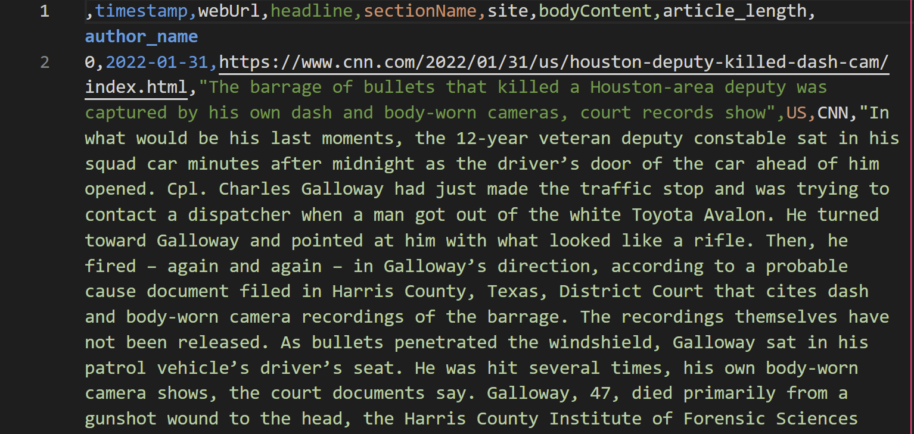

# CNNWebScraper

Using BeautifulSoup to gather article contents from CNN exporting into a CSV
file.

> Author: [Faris Durrani](https://github.com/farisdurrani)  
> GitHub: https://github.com/farisdurrani/CNNWebScraper

# Description

Originally created to develop an ML-based bias analyzer on popular news websites
for
[AGORAx](https://theagorax.com/) (plans delayed indefinitely), this Python
script uses BeautifulSoup to recursively scrape all text articles accessible from the CNN
Site Map
of the selected years.
See [CNN Site Map 2016](https://www.cnn.com/article/sitemap-2016.html)
for example. You can enable multiprocessing for much faster scraping at the
expense
of computer resources. Results are exported to a CSV with a random name.

For each article, the following are retrieved:
- `timestamp`: Date of publication (yyyy-mm-dd)
- `webUrl`: URL of article
- `headline`: headline of article
- `sectionName`: section of article
- `site`: Hardcoded to `CNN`
- `bodyContent`: Full text of article body, HTML-sanitized by BeautifulSoup, truncated to the first 31,500 characters (~5,000 words)
- `article_length`: Count of characters of full article body before truncation
- `author_name`: Author name of article

## How to Use

### Requirements

1. Python 3.10
1. Install the required packages in `requirements.txt`

### Usage

1. Optional: Modify search options to scrape from https://www.cnn.com/,
   modifying appropriately in `cnn_scraper.py`:
    - `SELECTED_DATES` - calendar dates (`01`, `02`, ..., `31`) of articles to
      scrape
    - `SELECTED_MONTHS` - calendar months (`01`, `02`, ..., `12`) of articles to
      scrape. Can also be `set()` to include all months 
    - `SELECTED_YEARS` - calendar years (`2010`, `2009`, `2022`, ...) of
      articles to scrape. Can also be `set()` to include all months
    - `SELECTED_TOPICS` - topics to scrape.
      See [CNN Site Map 2016](https://www.cnn.com/article/sitemap-2016.html) for
      article section examples
    - `OUTPUT_FILENAME` - output filename
    - `GET_EVERY_X_ARTICLE_PER_MONTH_TOPIC` - `1` to get all articles, `2` to
      get every other article only, etc.
    - `USE_MULTIPROCESSING` - `True` to enable very fast scraping, at risk of
      crashing the machine for insufficient resources. `False` otherwise
1. Run `python cnn_scraper.py` and see the output in [/outputs](./outputs) by default. The reader may see
   a sample output as described below.

# Output

See sample output
in [cnn_articles-2022-3409.csv](./outputs/output_samples/cnn_articles-2022-3409.csv)
for scraped US articles in January 2022. Note that opening the file in Excel 
automatically formats the date.

# License

CNNWebScraper is MIT licensed, as found in the [LICENSE](./LICENSE) file.

CNNWebScraper documentation is Creative Commons licensed, as found in
the [LICENSE-docs](.github/LICENSE-docs) file.
