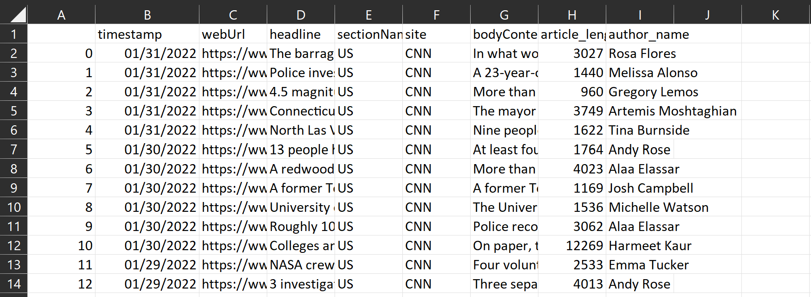

# CNNWebScraper

A simple Python Beautifulsoup script to gather article contents from CNN and put them into a CSV file. Created to develop a ML-based bias  analyzer on popular news websites for [AGORAx](https://theagorax.com/) (plans delayed indefinitely).

Author: [Faris Durrani](https://github.com/farisdurrani)  
Source: [GitHub](https://github.com/farisdurrani/CNNWebScraper)  
Implemented: October 2021

## How to Use

### Requirements
1. Use Python 3.6.8
2. Install the required packages in `requirements.txt`

### Usage
1. Choose which year and topics to scrape from https://www.cnn.com/, modifying appropriately `selected_years` in line 206 and `topics` in line 209 in `cnn_scraper.py`.
2. Run the script `cnn_scraper.py` and see the output in a new file labeled `cnn_articles.csv`, in addition with an `errors.txt` file that lists all errors encountered like broken links. The reader may see some sample outputs in the `output_samples` directory.

> **Note**  
> This script only parses text strings, not media items like pictures and videos.

## Output

The screenshot below shows a preview of what the output is like. The `bias` score is hardcoded as part of the first iteration of this project. The `title` and `article` contents are stored in UTF-8 format, and unsurprusingly, the `article` content can be very long (see number of `characters`). `comments` notes of any abnormal `article` contents like `EMPTY` if there are almost no text in the scrapped webpage (mostly due to it being a video article), or `TRUNCATED` if the number of characters of the article exceeds the Microsoft Excel cell limit of [32,767 characters](https://support.microsoft.com/en-us/office/excel-specifications-and-limits-1672b34d-7043-467e-8e27-269d656771c3).

## License

CNNWebScraper is MIT licensed, as found in the [LICENSE](./LICENSE) file.

CNNWebScraper documentation is Creative Commons licensed, as found in the [LICENSE-docs](.github/LICENSE-docs) file.
